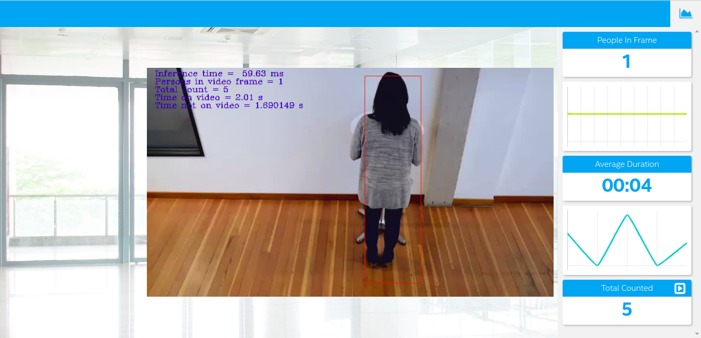

# Project Write-Up



You can use this document as a template for providing your project write-up. However, if you
have a different format you prefer, feel free to use it as long as you answer all required
questions.

## Explaining Custom Layers

The process behind converting custom layers involves...
In the case where a model contains layers not included in the list of supported layers, the Model Optimizer ends up classifying these unknown layers as custom. A layer can be defined as a math function concept which is used for a defined purpose like a sigmoid, convolutional, tanh. In addition to that they are known as a building block in a neural network.

Before the Model Optimizer builds a model's internal representation, optimizes it, and produce the Intermediate Representation files, it first scans for unknown layers in the input model topology. Layers in the IR files are loaded into the device plugin specified by the Inference Engine. An error is reported by the Inference Engine in the case where a topology containing unknown layers is loaded to the specified device plugin.

To successfully implement custom layers, extensions to the Model Optimizer and Inference Engine should be added. For the Model Optimizer, durinf model extraction the Custom Layer Extractor(.py) should be specified. In addition to that, during Model optimization, the Custom Layer Operation(.py) extension should be specified too.

The Model Optimizer extracts information from the input model such as the input and output format, topology of model layers and the model parameters. Afterwards, the model is optimized in relation to the information collected from the model and and IR files generated for the Inference Engine.


[Model Optimizer processing steps](https://docs.openvinotoolkit.org/latest/_docs_HOWTO_Custom_Layers_Guide.html)

- The Custom Layer Extractor

	Its purpose is to extract important information from the input model

- Custom Layer Operation

	Specifies the attributes supported by the custom layer and computes the output shape for each instance of the custom layer and parameters.

There are two Custom Layer Extensions for the Inference Engine, that is, the CPU and GPU Plugins. Implementation of custom layers is done in relation to the target device specified.

- Custom Layer CPU Extension

	Uses a compiled shared library(.dll binary or .so) that the CPU Plugin requires to execute the custom layers.

- Custom Layer GPU Extension

	Custom layer kernel for GPU Plugin requires two files. The layer description file (.xml) and the OpenCL source code(.cl) for the custom layer kernel which is compiled for execution on the GPU.
	


[Inference Engine basic flow](https://docs.openvinotoolkit.org/latest/_docs_HOWTO_Custom_Layers_Guide.html)
	
[More...](https://docs.openvinotoolkit.org/latest/_docs_HOWTO_Custom_Layers_Guide.html)


Some of the potential reasons for handling custom layers are...

- The common reason of handling custom layers is to establish if there exists supported layers in each of the fed layers from a model. If there exists a layers not supported by the Plugin device, an alternative to creating a new custom layer is to target an additional device using the HETERO plugin. 

- The Heterogeneous Plugin is therefore used to run an inference model on multiple devices allowing the unsupported layers on one device to "fallback" to run on another device (e.g., CPU) that does support those layers.

## Comparing Model Performance

My method(s) to compare models before and after conversion to Intermediate Representations
were...

The difference between model accuracy pre- and post-conversion was...

The size of the model pre- and post-conversion was...

The inference time of the model pre- and post-conversion was...

## Assess Model Use Cases

Some of the potential use cases of the people counter app are...

- A people counting app can be used in any business to keep track of the numbers of customers comming in and out of the premises. This will help the owner to keep track of the statistics of his customers.

- This application can be used in a school set up to keep count of the students getting in of a classroom and in case the number does not match the expected number at a specified time, the application notifies the relevent authorities of a missing count.

- This application can be implemented in a banking facility where it tracks the number of people and the time they take on an ATM. 

Each of these use cases would be useful because...

- The first case, will help business owners to capture all statistics related to the number of customers visiting their business. The can use this data to evaluate the days that they experience the largest number of customers or the time of the year there are most customers visiting and will eventually know whether to restock or remain with their current volume of stock in relation to the customer's statistics collected by the app.

- The second case scenario would be useful to track cases where students fail to attend classes and notify the authorities to take action.

- In a banking setup, collecting figures of the number of people and the time they take operating the ATM will help make informed decisions on whether to increase the number of ATMs depending on people's congestion.

## Assess Effects on End User Needs

Lighting, model accuracy, and camera focal length/image size have different effects on a
deployed edge model. The potential effects of each of these are as follows...

- In low lighting the model is expected to perform poorly because of the inability to detect a perform in a dark frame. On the other hand, good lighting ensures that detections are made correctly without missing counts.

- Model accuracy, expecially when it is low, may result to miscounts of persons on the frame intefering with tht e total time a person stays on the frame. A model with a high detecting accuracy will ensure that accurate detections are made giving correct figures of the total count and the total time a person stays on the video.

- A camera's focal length and image size have a significant influence on the results obtained. A good image size results to a good image resolution. In result, a pre-trained model will be able to accurately detect the edges of a person in each pixel corretly.

## Model Research

[This heading is only required if a suitable model was not found after trying out at least three
different models. However, you may also use this heading to detail how you converted 
a successful model.]

In investigating potential people counter models, I tried each of the following three models:

- ### Model 1:
```
ssd_mobilenet_v2_coco_2018_03_29
```
  [Model Source](http://download.tensorflow.org/models/object_detection/ssd_mobilenet_v2_coco_2018_03_29.tar.gz)
  ```
  http://download.tensorflow.org/models/object_detection/ssd_mobilenet_v2_coco_2018_03_29.tar.gz
  ```

I converted the model to an Intermediate Representation with the following arguments...
1. Navigate to the download directory
```
cd [Download directory]
```
2. Extract model file downloaded
```
tar -xvf ssd_mobilenet_v2_coco_2018_03_29.tar.gz 
``` 

3. Enter the folder the downloaded model was extrated to
```
cd ssd_mobilenet_v2_coco_2018_03_29/
```
4. Command to convert the pretrained model to Intermediate Representation
```
python /opt/intel/openvino/deployment_tools/model_optimizer/mo.py --input_model frozen_inference_graph.pb --tensorflow_object_detection_api_pipeline_config pipeline.config --reverse_input_channels --tensorflow_use_custom_operations_config /opt/intel/openvino/deployment_tools/model_optimizer/extensions/front/tf/ssd_support.json --input_shape [1,300,300,3]
```


  - The model was insufficient for the app because...
	Accuracy of the model was low when detecting a person in a frame
  - I tried to improve the model for the app by...
	Lowered the value of the probability threshold but ended up detecting multiple objects that were not persons in one frame.
  
- ### Model 2: 
```
faster_rcnn_nas_coco_2018_01_28
```
  - [Model Source](http://download.tensorflow.org/models/object_detection/faster_rcnn_nas_coco_2018_01_28.tar.gz)
  ```
  http://download.tensorflow.org/models/object_detection/faster_rcnn_nas_coco_2018_01_28.tar.gz
  ```

  - I converted the model to an Intermediate Representation with the following arguments...
1. Enter into the download directory
```
cd [Download directory]
```
2. Extract model file downloaded
```
tar -xvf faster_rcnn_nas_coco_2018_01_28.tar.gz # 
```
3. Enter the folder that the model file was extracted to
```
cd faster_rcnn_nas_coco_2018_01_28/ 
```
4. Command to convert the tensorflow pretrained model to Intermediate Representation

```
python /opt/intel/openvino/deployment_tools/model_optimizer/mo.py --input_model frozen_inference_graph.pb --tensorflow_object_detection_api_pipeline_config pipeline.config --reverse_input_channels --tensorflow_use_custom_operations_config /opt/intel/openvino/deployment_tools/model_optimizer/extensions/front/tf/faster_rcnn_support.json --input_shape [1,1200,1200,3]
```

  - The model was insufficient for the app because...
  	- Network has 2 inputs overall

  - I tried to improve the model for the app by...
  	- Co..

- ### Model 3:
```
faster_rcnn_inception_v2_coco_2018_01_28.tar.gz
```
  - [Model Source](http://download.tensorflow.org/models/object_detection/faster_rcnn_inception_v2_coco_2018_01_28.tar.gz)
  ```
  http://download.tensorflow.org/models/object_detection/faster_rcnn_inception_v2_coco_2018_01_28.tar.gz
  ```

  - I converted the model to an Intermediate Representation with the following arguments...
1. Enter into the download directory
```
cd [Download directory]
```
2. Extract model file downloaded
```
tar -xvf faster_rcnn_inception_v2_coco_2018_01_28.tar.gz
```
3. Enter the directory where the model has been extracted to
```
cd faster_rcnn_inception_v2_coco_2018_01_28/
```
4.  Command to convert the tensorflow pretrained model to Intermediate Representation
```
python /opt/intel/openvino/deployment_tools/model_optimizer/mo.py --input_model frozen_inference_graph.pb --tensorflow_object_detection_api_pipeline_config pipeline.config --reverse_input_channels --transformations_config /opt/intel/openvino/deployment_tools/model_optimizer/extensions/front/tf/faster_rcnn_support.json --input_shape [-1,600,600,3]
```

  - The model was insufficient for the app because...
1. Network has 2 inputs overall
2. On using the model in the app, I got an error that the model only receives two input topologies

  - I tried to improve the model for the app by...

- Model 4: 
```
MobileNet-SSD
```
  - [Model Source](https://codeload.github.com/chuanqi305/MobileNet-SSD)
  ```
  https://codeload.github.com/chuanqi305/MobileNet-SSD
  ```

  - I converted the model lsto an Intermediate Representation with the following arguments...
1. Enter into the download directory
```
cd [Download directory]
```
2. Enter into the model extracted folder
```
cd MobileNet-SSD-master/
```
3. Command to convert the Caffe pretrained model to Intermediate Representation
```
python /opt/intel/openvino/deployment_tools/model_optimizer/mo.py --input_model mobilenet_iter_73000.caffemodel --input_proto deploy.prototxt
```

  - The model was insufficient for the app because...
  	- No accurate detections were made using the model
	- Detected not satisfied dependencies:
	- protobuf: installed: 3.7.1, required: == 3.6.1

  - I tried to improve the model for the app by...

# References
1.  udacity/nd131-openvino-fundamentals-project-starter. GitHub. (2020). Retrieved 18 May 2020, from https://github.com/udacity/nd131-openvino-fundamentals-project-starter.
2. Custom Layers Guide - OpenVINO™ Toolkit. Docs.openvinotoolkit.org. (2020). Retrieved 27 May 2020, from https://docs.openvinotoolkit.org/latest/_docs_HOWTO_Custom_Layers_Guide.html.
